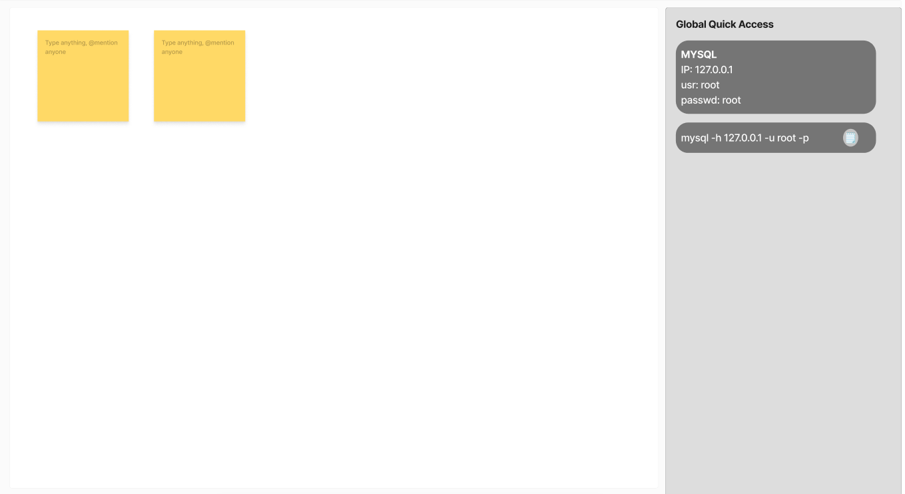

# NoteBoard
--- 
###### _never get slowed down by searching for small miscellaneous datas while development_

_NoteBoard_ is a tool intended for developers to access creds / pieces of text / code snippets quickly so that they can spend precious time on designing new logic, rather than searching for that snippet/password or re-writing the same code snippet again.

### DEVELOPMENT STATUS
nothing done so far... gotta start soon...

## Features to impliment
    add/delete new note
    add/delete new quickNote
    impliment quick copy button on quickNote

## rought UI
